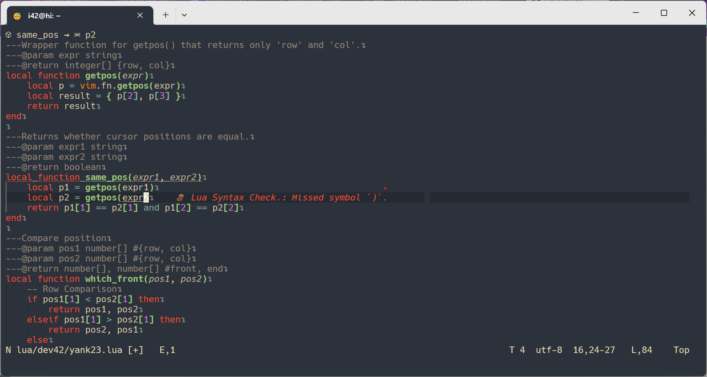

# neovim configuration base my usage habit

## how to use

**[中文指南](https://github.com/HUAHUAI23/nvim64)**

1. download The latest Neovim
2. `git clone https://github.com/HUAHUAI23/nvim-quietlight.git to ./config/nvim`

the keybindings file is on <https://github.com/HUAHUAI23/myneovimlua/blob/main/lua/keybindingAlias.lua> if you want to change keybinding

<table align="center">
  <tr>
    <td>
      
    </td>
    <td>
      
    </td>
  </tr>
</table>
